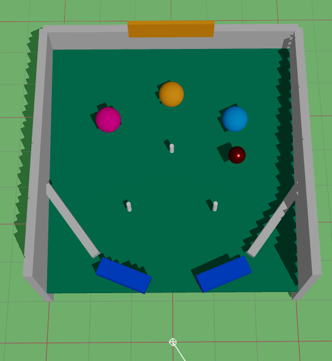

# XRift World - ピンボール

マルチプレイヤー対応の3Dピンボールゲームワールドです。




## 概要

このプロジェクトは、[XRift](https://xrift.jp)プラットフォームで動作するWebXRピンボールゲームです。React Three FiberとRapier物理エンジンを使用して構築されており、複数ユーザー間でゲーム状態がリアルタイムに同期されます。

## 特徴

- 🎮 物理エンジンによるリアルなピンボール挙動
- 👥 マルチプレイヤー対応（ボール位置・スコアの同期）
- 🔄 インタラクティブなフリッパー操作
- 🏆 スコア＆ハイスコア表示
- ⚡ バンパー衝突による得点システム

## ゲーム要素

- **ボール**: 赤いメタリックなボール
- **フリッパー**: 左右のフリッパーをクリックで操作
- **バンパー**: ボールが衝突すると10点獲得
- **ピン**: ボールの軌道を変える障害物

## 技術スタック

- [React Three Fiber](https://docs.pmnd.rs/react-three-fiber/) - React向けThree.jsレンダラー
- [React Three Drei](https://github.com/pmndrs/drei) - React Three Fiber用ヘルパー
- [React Three Rapier](https://github.com/pmndrs/react-three-rapier) - 物理エンジン
- [@xrift/world-components](https://www.npmjs.com/package/@xrift/world-components) - XRift用コンポーネント
- [Vite](https://vitejs.dev/) - 高速ビルドツール
- [Module Federation](https://module-federation.io/) - 動的モジュールローディング

## 開発

### 前提条件

- Node.js 18以上
- npm または yarn

### セットアップ

```bash
# 依存関係のインストール
npm install

# 開発サーバー起動
npm run dev
```

開発サーバーは http://localhost:5173 で起動します。

### ビルド

```bash
# プロダクションビルド
npm run build

# 型チェック
npm run typecheck
```

### XRiftへのアップロード

```bash
# XRift CLIを使用してアップロード
xrift upload world
```

## プロジェクト構成

```
pinball/
├── public/                 # 静的アセット
│   └── thumbnail.png      # サムネイル画像
├── src/
│   ├── components/        # 3Dコンポーネント
│   │   └── Pinball/      # ピンボールゲームコンポーネント
│   ├── constants.ts      # 定数定義
│   ├── dev.tsx           # 開発用エントリーポイント
│   ├── index.tsx         # 本番用エクスポート
│   └── World.tsx         # メインワールドコンポーネント
├── xrift.json            # XRift設定ファイル
└── vite.config.ts        # Vite設定
```

## マルチプレイヤー同期

このワールドでは `useInstanceState` フックを使用して、以下の状態を全ユーザー間で同期しています：

- ボールの位置と速度
- フリッパーの回転状態
- 現在のスコアとハイスコア
- ボールの物理演算担当プレイヤー

フリッパーを操作したプレイヤーがボールの物理演算を担当し、他のプレイヤーは同期された位置を表示します。

## ライセンス

MIT License
